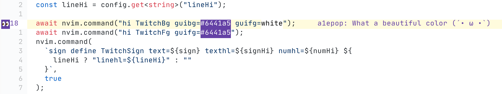

# coc-twitch-highlight

Twitch code highlight extension for [coc.nvim](https://github.com/neoclide/coc.nvim)

## Description
Allow users from a Twitch chat highlight code lines into current vim buffer.

## How to use 
Bot handle messages with format:
```bash
!line [line number] [comment]
```
Example
```bash
!line 18 What a beautiful color (´• ω •`)
```


## Install

`:CocInstall coc-twitch-highlight`

## Commands

- `:CocCommand twitchHighlight.stop`: Disconnect twitchHighlight bot from a chat
- `:CocCommand twitchHighlight.start`: Connect twitchHighlight bot to a chat
- `:CocCommand twitchHighlight.remove`: Remove sign under the cursor
- `:CocCommand twitchHighlight.removeAll`: Remove all twitch signs

## Keymaps

- Normal mode: `<Plug>(coc-twitch-highlight-start)`
- Normal mode: `<Plug>(coc-twitch-highlight-stop)`
- Normal mode: `<Plug>(coc-twitch-highlight-remove)`
- Normal mode: `<Plug>(coc-twitch-highlight-remove-all)`

```vim
" example configuration
nmap <leader>tr <Plug>(coc-twitch-highlight-remove)
```

## Configuration

```json
"twitchHighlight.enabled": {
  "type": "boolean",
  "default": true,
  "description": "Enable coc-twitch-highlight extension"
},
"twitchHighlight.sign": {
  "type": "string",
  "default": "👀",
  "description": "Text of Twitch highlight sign"
},
"twitchHighlight.signHi": {
  "type": "string",
  "default": "TwitchBg",
  "description": "Highlight group for sign"
},
"twitchHighlight.numHi": {
  "type": "string",
  "default": "TwitchFg",
  "description": "Highlight group for sign numhl"
},
"twitchHighlight.lineHi": {
  "type": "string",
  "description": "Highlight group for sign linehl"
},
"twitchHighlight.commentHi": {
  "type": "string",
  "default": "TwitchFg",
  "description": "Highlight group for sign comment"
},
"twitchHighlight.commentPrefix": {
  "type": "string",
  "default": "    ",
  "description": "Prefix for comment to display in virtual text"
},
"twitchHighlight.bot.username": {
  "type": "string",
  "description": "Twitch username"
},
"twitchHighlight.bot.oauth": {
  "type": "string",
  "description": "Twitch oauth token"
},
"twitchHighlight.bot.channel": {
  "type": "string",
  "description": "Twitch channel to connect"
}
```

## License

MIT

---

> This extension is created by [create-coc-extension](https://github.com/fannheyward/create-coc-extension)
